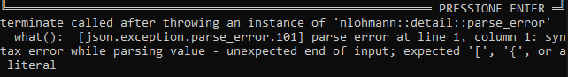

# Projeto R

Em um tempo muito diferente do nosso, um peque pedaço de terra é disputado a gerações por duas famílias, os Redmonds eos Caham. A cada 40 anos, o Torneio “Círculo do Trono Prismático” decide o quem sera o dono daquele território, suas caças, produções e impostos. A cada família, o direito de escolher um campeão entre seus vassalos. Dessa vez, os Redmons decidiram realizar um sorteio para escolher seu novo guerreiro. Este, terá a chance de subir ao panteão dos herois de seu povo, caso vença o compeonato, ou cair na mais devastadora desonra e revés, caso não tenha sorte. Alheio a essas decisões e batalhas, um jovem campones tem sua vida pacata revirada quando da chegada do mensageiro real com a notificação de que havia sido o ‘sortudo’. A sua frente, um distino completamente diferente do que estava acostumado ou desejava. Recusar não é uma opção.

## Documentação
* [Project Model Canvas](docs/PMC.png)
* [Fluxograma](docs/fluxograma.bmp)
* [Descrição Narrativa](docs/PROJETO R.pdf)

-----
## Download

Versão 1.0
* [Arquivo.zip](release/v1-0.zip)
* [Projeto Codeblocks](release/codeblocks.zip)

-----
## Solução de Problemas
Meu jogo esta deconfigurado. O que fazer?

<iframe width="690" height="388" src="https://www.youtube.com/embed/3FzXb4rsZIs" frameborder="0" allow="accelerometer; autoplay; encrypted-media; gyroscope; picture-in-picture" allowfullscreen></iframe>

Meu jogo esta apresentando a mensagem de erro como a abaixo, o que fazer?

  Para solucionar, verifique se o arquivo _cenarios.json_ esta na mesma pasta do executável _PII.exe_. Caso não tenha esse arquivo, baixe ele [aqui](https://raw.githubusercontent.com/carlosbarretoeng/PII-2020-1/master/codeblocks/cenarios.json).